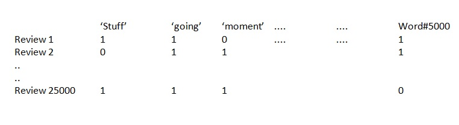

# NLP_KAGGLE_DATASET_COMMENTS_SENTIMENT_ANALYSIS
<h2>MACHINE LEARNING PROJECT</h2>

<h3>ENTIMENT ANALYSIS ON IMDB MOVIE REVIEWS KAGGLE DATA SET USING NLP (Natural Language Processing)</h3>

<b>The steps taken in the project are listed below, one by one.</b>

- We are loading our data sets..
- To clean stopwords, we need to download the stopwords word set from the nltk library to our computer.
- We do this with nltk. nltk.download('stopwords')

 
<b>Data Cleansing Procedures </b>

### First, we will delete HTML tags from review sentences using the BeautifulSoup module. To explain how these operations are performed, the example was first made in a single review.

- After HTML tags are cleaned..
- we clean it from punctuation marks and numbers - using regex..
- We convert it to lowercase, so that our machine learning algorithms do not recognize words that start with a capital letter as different words:
- stopwords (we want words like the, is, are not to be used by artificial intelligence. These are grammatical words..)
- First, we divide the words with split and turn them into a list, our aim is to remove stopwords..
- After explaining the cleaning process, we now collectively clean the reviews in our entire dataframe in the loop
- For this purpose, we first create a function:
- we combine splitted paragraphs with space return

### We see the status of the review process by printing a line after every 1000 reviews.
### Train, test split operation is in progress.
### We are creating Bag of Words!

<b>We have cleaned our data, but for artificial intelligence to work, it is necessary to convert this text-based data into numbers and a matrix called bag of words. We use the CountVectorizer tool in sklearn for this purpose:</b>

- Using the countvectorizer function in sklearn, we create a bag of words with a maximum of 5000 words...
- We convert our train data into feature vector matrix
- We are converting this to array because it requires array for fit operation.

### We create and fit the Random Forest Model

### test data
- We convert our test data into feature vector matrix
- In other words, we repeat the same operations (converting into bag of words).
####We make predictions..
